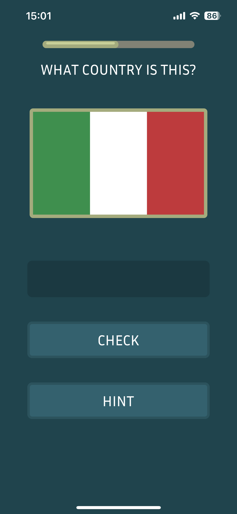
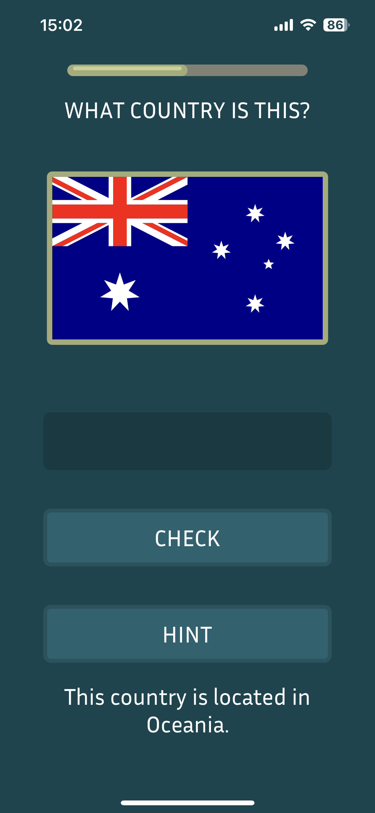
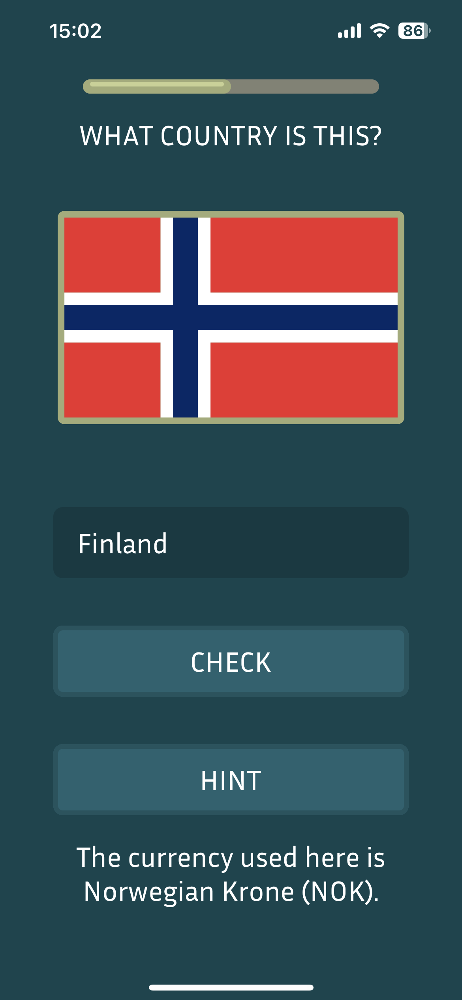

# flaglee

Welcome to the Flag Guessing Game – a fun and educational mobile app built using React Native and Expo. Test your knowledge of world flags and learn about different countries as you play!

## Demo
- User Interface

- Hints

- Typed Answer (incorrect)

## Features
- Guess the country by its flag.
- Learn about different countries and their flags.
- Fun and engaging user interface.
